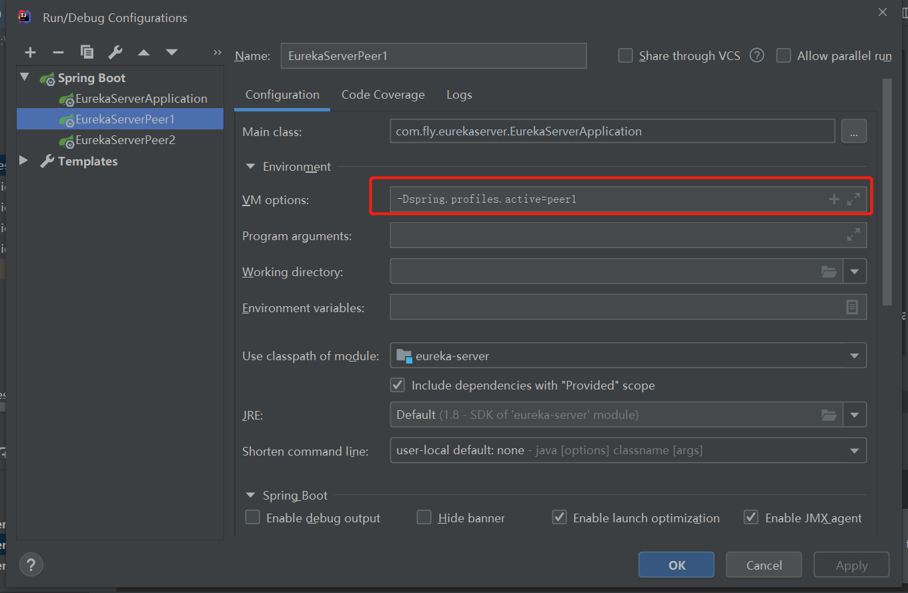
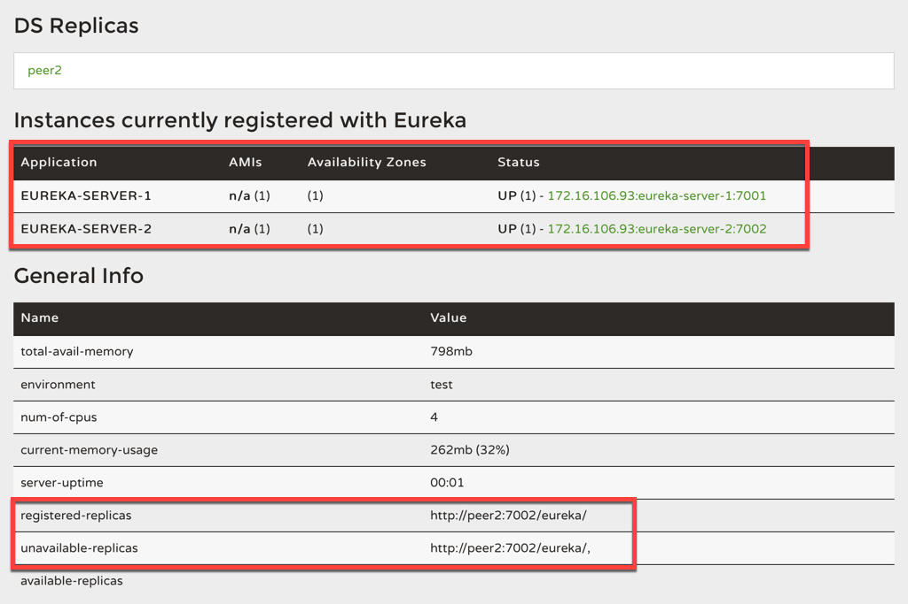

# Eureka服务注册与发现 

**@EnableEurekaServer**:启动服务注册中心（springboot工程的启动类）


# 集群

注册中心这么关键的服务，如果是单点话，遇到故障就是毁灭性的。在一个分布式系统中，服务注册中心是最重要的基础部分，理应随时处于可以提供服务的状态。为了维持其可用性，使用集群是很好的解决方案。Eureka 通过互相注册的方式来实现高可用的部署，所以我们只需要将 Eureke Server 配置其他可用的 service-url 就能实现高可用部署。

### 多节点部署

在生产中我们可能需要三台或者大于三台的注册中心来保证服务的稳定性，配置的原理其实都一样，将注册中心分别指向其它的注册中心。这里只介绍三台集群的配置情况，其实和双节点的注册中心类似，每台注册中心分别又指向其它两个节点即可。

- server.port：为了与后续要进行注册的服务区分，这里将服务注册中心的端口设置为 7000。
- eureka.client.register-with-eureka：表示是否将自己注册到 Eureka Server，默认为 true。
- eureka.client.fetch-registry：表示是否从 Eureka Server 获取注册信息，默认为 true。
- eureka.client.service-url.defaultZone：设置与 Eureka Server 交互的地址，查询服务和注册服务都需要依赖这个地址。默认是 http://localhost:8761/eureka ；多个地址可使用英文逗号（,）分隔。

通过eureka.client.registerWithEureka：false和fetchRegistry：false来表明自己是一个eureka server.


1. 将application.yml 复制一份并命名为 application-peer1.yml，作为 peer1 服务中心的配置，并将 service-url 指向 peer2

   ```yaml
   spring:
     application:
       name: eureka-server
   server:
     port: 7001
   eureka:
     instance:
       hostname: peer1
     client:
       register-with-eureka: true
       fetch-registry: true
       service-url:
         defaultZone: http://peer2:7002/eureka/,http://peer3:7003/eureka/
   
   ```

2. 将 application-peer1.yml 复制一份并命名为 application-peer2.yml，作为 peer2 服务中心的配置，并将 service-url 指向 peer1

   ```yaml
   spring:
     application:
       name: eureka-server
   server:
     port: 7002
   eureka:
     instance:
       hostname: peer2
     client:
       register-with-eureka: true
       fetch-registry: true
       service-url:
         defaultZone: http://peer1:7001/eureka/,http://peer1:7003/eureka/
   ```

3. application-peer3.yml参照application-peer2.yml

4. 配本地 host：在 hosts 文件中加入如下配置

   ~~~
   127.0.0.1 peer1 peer2
   ~~~

5. 打包启动

   ~~~shell
   # 打包
   mvn clean package  -Dmaven.test.skip=true
   
   # 分别以 peer1 和 peer2 和 peer3 配置信息启动 Eureka
   java -jar target/eureka-server-0.0.1-SNAPSHOT.jar  --spring.profiles.active=peer1
   java -jar target/eureka-server-0.0.1-SNAPSHOT.jar  --spring.profiles.active=peer2
   java -jar target/eureka-server-0.0.1-SNAPSHOT.jar  --spring.profiles.active=peer3
   ~~~

6. IDEA中配置


   

**注意事项**

- 在搭建 Eureka Server 双节点或集群的时候，要把 `eureka.client.register-with-eureka` 和 `eureka.client.fetch-registry` 均改为 `true`（默认）。否则会出现实例列表为空，且 peer2 不在 available-replicas 而在 unavailable-replicas 的情况（这时其实只是启动了两个单点实例）。如果是像我这样图省事把之前的单节点配置和双节点的配置放在一个工程里，双节点的配置里要显示设置以上两个参数，直接删除是用不了默认配置的 ——Spring profile 会继承未在子配置里设置的父配置（application.yml）中的配置。
- 在注册的时候，配置文件中的 `spring.application.name` 必须一致，否则情况会是这样的
  


